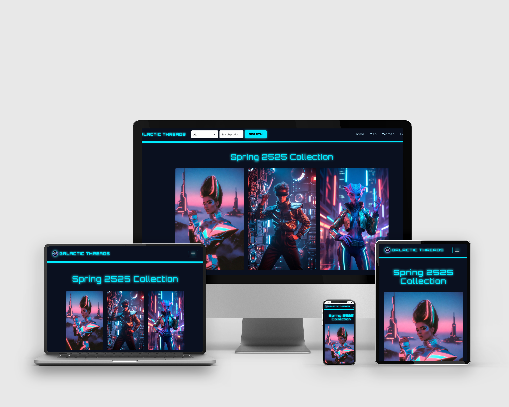

# Galactic Threads — Full Project Documentation
 
# Live Site https://galacticthreads-e560b1182318.herokuapp.com/index.html

## 📱 Apple Devices Mockup

  

Galactic Threads is a futuristic, Tron‑inspired e‑commerce platform featuring a glowing neon UI, dynamic product loading, a full shopping experience, and a complete admin panel for managing products, categories, and orders.

This documentation covers the entire system: architecture, routes, database schema, admin panel, and development workflow.

## 2. Tech Stack

### Frontend
- HTML5  
- CSS3 (Tron‑inspired theme)  
- Vanilla JavaScript  
- Responsive layout
- Dynamic product loading
- Session‑aware UI

### Backend
- Node.js  
- Express.js  
- PostgreSQL  
- Cloudinary (image hosting)
- Multer + CloudinaryStorage (file uploads)  
- express‑session (authentication)  
- bcrypt (password hashing)  
- SendGrid (password reset emails)

### Hosting
- Heroku (server + PostgreSQL)
- Cloudinary (Images)

### Database
- SQLite (`db.sqlite`)  
- Auto‑created tables via `init-db.js`

## 3. Features

### Storefront
- Men’s and Women’s collections  
- Dynamic product loading  
- Product descriptions, images, prices, sizes
- Add to basket  
- Update cart quantities  
- Checkout  
- Order Confirmation
- Order history  

### User Accounts
- Register  
- Login  
- Session‑based authentication  
- View past orders  
- Password Reset via email (SendGrid)

### Admin Panel
- View all products (active + inactive)  
- Add new products  
- Edit existing products  
- Upload/replace images  
- Manage categories
- Reorder products (drag & drop)
- Delete products (hard delete)  
- Manage categories  
- View and fulfill orders  

## 4. Project Structure

/public
  /assets
    /css
    /js
    /images
  index.html
  men.html
  women.html
  login.html
  register.html
  forgot-password.html
  reset-password.html
  my-orders.html
  checkout.html

/server
  server.js
  /templates
    resetPasswordEmail.js

.env
package.json
Procfile

## 5. Database Schema

### Users
| Column     | Type    | Notes        |
|------------|---------|--------------|
| id         | INTEGER | PK           |
| firstName  | TEXT    |              |
| lastName   | TEXT    |              |
| email      | TEXT    | Unique       |
| password   | TEXT    | Hashed       |
| isAdmin    | INTEGER | 0 or 1       |

### Categories
| Column | Type    |
|--------|---------|
| id     | INTEGER |
| name   | TEXT    |

### Products
| Column      | Type    |
|-------------|---------|
| id          | INTEGER |
| name        | TEXT    |
| price       | REAL    |
| description | TEXT    |
| image       | TEXT    |
| category_id | INTEGER |
| active      | INTEGER |

### Carts
| Column     | Type    |
|------------|---------|
| id         | INTEGER |
| user_email | TEXT    |

### Cart Items
| Column     | Type    |
|------------|---------|
| id         | INTEGER |
| cart_id    | INTEGER |
| product_id | INTEGER |
| quantity   | INTEGER |

### Orders
| Column     | Type    |
|------------|---------|
| id         | INTEGER |
| user_email | TEXT    |
| total      | REAL    |
| created_at | TEXT    |
| status     | TEXT    |

### Order Items
| Column     | Type    |
|------------|---------|
| id         | INTEGER |
| order_id   | INTEGER |
| product_id | INTEGER |
| quantity   | INTEGER |
| price      | REAL    |

### Password Reset Tokens

|Column	     | Type      |
|------------|-----------|
|id	         | SERIAL    |
|email	     | TEXT      |
|token	     | TEXT      |
|expires_at	 | TIMESTAMP |

## 6. Backend Route Reference

### Authentication
POST /api/register 

POST /api/login

GET  /api/session

POST /api/logout

## 7. Admin Panel Documentation

### admin-products.html
- Loads all products via `/api/admin/products`
- Supports:
  - Search  
  - Category filter  
  - Active filter  
- Provides Edit/Delete actions  

### admin-edit-product.html
- Loads product via `/api/product/:id`
- Updates via `/api/admin/product/:id`
- Supports:
  - Image preview  
  - Category selection  
  - Active/inactive toggle  

### admin-add-product.html
- Adds new products via `/api/admin/product`
- Supports:
  - Image upload  
  - Category selection  

## 13. Credits

Developed by **Andy Brookes**  
Lancaster, UK  
